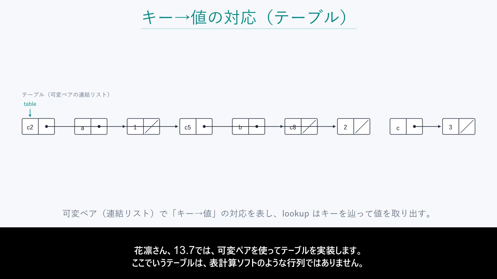
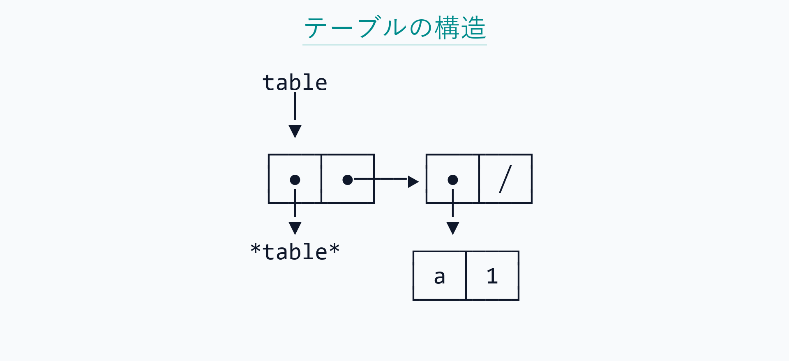

# BlockVideo

日本語の台本を貼り付けると、スライド・ナレーション・字幕入りの MP4 を出力する
ローカル Web アプリです。
プロジェクト画面の「言葉で操作する」欄から、「字幕を64pxにして作り直して」のような日本語の依頼で
設定の変更・動画の生成・キャンセル・設定や完成動画の巻き戻しができます。依頼の解釈は手元の小さな
ローカルモデル（LM Studio）が行い、実行は登録済みの処理だけが行います。詳しくは
[言葉で操作する](#言葉で操作する自然言語インターフェース)と[拡張性の設計](#拡張性の設計操作カタログragyolo)を参照してください。

クラウドも認証も課金もなく、すべて自分のマシンで完結します。音声合成は
[VOICEVOX](https://voicevox.hiroshiba.jp/)、動画の書き出しは ffmpeg、
台本の分割だけ OpenAI 互換 API を使います（キーは自分のものを持ち込む BYOK 方式）。

```
台本 ──▶ 分割 ──▶ スライド ──▶ VOICEVOX ──▶ ffmpeg ──▶ MP4
                    (台本が指定)   (音声+タイミング)  (字幕焼き込み)
```



---

## 特徴

**スライドは台本が指定する。** 図を LLM に設計させると、台本に無い識別子
（`hdr`、`k2`、`local*` など）を発明します。実測で 77 ブロックの動画に
**115 個の捏造ラベル**が入りました。そこで台本側が ` ```slide ` ブロックで
中身を直接書き、それをそのまま描画します。捏造は構造的に起きません。

**アスキーアートが崩れない。** 罫線と日本語を混ぜると、フォント任せの描画では
必ず桁がずれます（日本語は英字の 2 倍幅）。端末と同じ固定文字グリッドに
1 文字ずつ配置し、字形を持つフォントを文字ごとに選ぶことで解決しています。



**字幕とスライドが音声とずれない。** VOICEVOX の `/audio_query` はモーラ単位の
長さを合成前に返し、実音声との誤差は **0.12%** です。これを使って文ごとの時刻を
測り、字幕の切り替えとスライドの切り替えを実際の発話に合わせます。

| | 文字数で按分（旧） | 実測タイミング（現行） |
|---|---|---|
| 字幕切替が実際の無音に収まる | 39% | **94%** |
| 無音からの平均ずれ | 338 ms | **56 ms** |
| スライド切替が文の区切りと一致 | 12/68 | **65/68** |

**説明に合わせて間と注目箇所を変える。** 新規プロジェクトでは、通常の説明は0.6秒、
図や注目箇所の切り替えは1.0秒、長い説明や要点は1.5秒を目安に文間を調整します。
字幕は話している文ごとに切り替わり、対応するスライドでは説明中のラベルを強調します。
一定の間が好みなら固定モードを選べます。話速を変えても文間の秒数を保ちます。

**言葉で操作でき、操作は書き足すだけで増やせる。** 操作の知識はカタログ（JSON）にまとめ、
依頼ごとに検索（RAG）で候補を数件に絞ってから小さなモデルに選ばせます。モデルが出すのは
構造化された提案だけで、実行は登録済みの処理だけが行います。

---

## 言葉で操作する（自然言語インターフェース）

プロジェクト詳細画面の上部「言葉で操作する」に依頼を入力します。

| 依頼の例 | 動き |
|---|---|
| 字幕を64pxにして | 設定を保存（動画は生成しない） |
| 字幕を少し大きく、話速1.2倍で作り直して | 設定をまとめて保存し、動画生成は確認してから開始 |
| ジョブ7を止めて | 指定したジョブをキャンセル |
| 第2版の設定に戻して／動画3に戻して | 設定の版／完成動画を戻す（履歴は消えない） |
| 第2版に戻してから動画を作り直して | 2〜4 手順の計画として 1 回の確認でまとめて実行 |
| ジョブ7は止めないで | 否定だけの依頼は何もせず取り下げる |

- 足りない値（「字幕を大きくして」の量など）や番号は聞き返します。依頼に書かれた値と食い違う提案は実行しません。
- **YOLO モード**: 入力欄の「確認なしで最後まで実行（YOLO）」をオンにすると（既定はオフ）、確認や質問をせず、
  書かれていない値は推測して最後まで実行し、推測した箇所を報告します。明示した否定や書いた値は守られます。
- **準備**: LM Studio でモデルを読み込み、`backend/.env` に `LANGUAGE_MODEL`（モデル名）を設定します。
  検索（RAG）を使うには索引を作り（`python -m scripts.operation_index build …`）、`LANGUAGE_RETRIEVAL_INDEX`
  に索引のフォルダーを指定します。未設定のときは全操作をモデルに渡す All Tools 方式で動きます。
  LM Studio のローカルサーバー（既定 `http://127.0.0.1:1234/v1`）以外の接続先は使えません。

## 拡張性の設計（操作カタログ・RAG・YOLO）

膨大な操作カタログから RAG で候補を数件に絞り、小さな LLM が候補の中から操作を選んで引数を埋めた提案を作り、
実行はコード（登録済みの処理）だけが行う、という構成です。

- **操作の知識はカタログに集約**: `backend/app/operations/` の次のファイルが唯一の情報源です。
  | ファイル | 内容 |
  |---|---|
  | `definitions.json` | 操作と引数の形 |
  | `operation_policies.json` | 変更系か、確認が必要か、否定の言い方、参照番号の種類、設定値の位置 |
  | `operation_annotations.json` | 日本語の言い方・同義語・使う場面（検索用） |
  | `search_scope.json` | 操作ごとの能力（検索の範囲） |
  | `../interpretation/prompt_rules.json` | モデルへの規則（操作ごと・モードごと） |
- **操作を追加する手順**: 上のファイルに書き足し、処理を 1 つ登録し、`python -m scripts.check_catalog`
  （`backend` で実行）で整合を確かめ、検索インデックスを作り直します（`python -m scripts.operation_index build`）。
  方針の無い操作は起動時に拒否されます。
- **規模の上限**: カタログ 4,096 操作、インデックス 16,384 文書、1 回のモデル呼び出しに載せる候補は 32 件まで
  （`backend/app/operations/limits.py`）。
- **YOLO モード**: 依頼欄の「確認なしで最後まで実行（YOLO）」をオンにすると（既定はオフ・このブラウザーに記憶）、
  確認や質問をせず、書かれていない値は推測して、設定の保存から動画の生成まで続けて実行します。
  明示された否定、書かれた値・番号、引数の形、実行直前の状態確認、`LANGUAGE_REVIEW_ALL` は外れません。
  結果には、自動で確認した操作と推測した箇所の報告が付きます。`LANGUAGE_YOLO_ENABLED=false` で無効にできます。

## 必要なもの

| | 用途 | 備考 |
|---|---|---|
| Python 3.13+ / [uv](https://docs.astral.sh/uv/) | バックエンド | |
| Node.js 20+ / pnpm | フロントエンド | |
| [ffmpeg](https://ffmpeg.org/) | 動画の書き出し | `ffmpeg` と `ffprobe` の両方 |
| [VOICEVOX Engine](https://voicevox.hiroshiba.jp/) | 音声合成 | 起動しておく（既定 `http://127.0.0.1:50021`） |
| OpenAI 互換 API キー | 台本の分割 | OpenAI / OpenRouter など。無くても後述の Fake モードで動作 |

Windows で ffmpeg が PATH に無い場合は `backend/.env` に絶対パスを書けます。
`GET /api/health` の `ffmpeg_available` で確認できます。

---

## セットアップ

```bash
git clone https://github.com/Rimcat-JA/blockvideo.git
cd blockvideo

make install          # backend (uv) + frontend (pnpm)
cp backend/.env.example backend/.env
```

`backend/.env` にキーを書きます（このファイルは `.gitignore` 済みです）。

```ini
LLM_API_KEY=sk-...
LLM_BASE_URL=https://api.openai.com/v1
LLM_MODEL=gpt-5.4-mini
LLM_MODEL_PLANNER=gpt-5.4-nano
```

起動します。VOICEVOX Engine を先に立ち上げてください。

```bash
make backend          # http://127.0.0.1:8000
make frontend         # http://127.0.0.1:5173
```

ブラウザで **http://127.0.0.1:5173/** を開くとクイック生成画面です。

> **開発中の注意**：バックエンドは `--reload` なしで起動します。コードを変更したら
> 手動で再起動してください。

---

## 使い方

### 1. 台本を書く

台本は「ブロック」の連なりです。1 ブロック＝ナレーション数文＋スライド 1 枚。
空行で区切ります。

````markdown
テーブルは、キーを渡すと対応する値を取り出せるデータ構造です。
保存には insert!、検索には lookup を使います。

```slide テーブルの抽象的な働き
保存
key ───────────▶ value

検索
key ─▶ table ─▶ value
```

一次元テーブルは、キーと値のペアを並べた連結リストとして作ります。

```slide 一つのレコード
┌───┬───┐
│ a │ 1 │
└───┴───┘
  ↑   ↑
 car cdr
```
````

` ```slide ` の中身はそのまま画面に出て、読み上げはされません。

**台本生成を LLM に頼む場合は、次のプロンプトをそのまま渡し、末尾の「今回の依頼」を埋めてください。**

| プロンプト | 向いている用途 |
|---|---|
| [`docs/script-prompt.md`](docs/script-prompt.md) | 汎用版。台本の形式とアスキーアートの描き方を守らせる |
| [`docs/script-prompt-passive.md`](docs/script-prompt-passive.md) | 講義資料や教科書を「再生して見ているだけで分かる」動画にする。説明の粒度・順番・繰り返し・間まで指定し、良い例と避ける例、推奨設定、長い動画の分け方を含む |

### 2. 貼り付けて生成

クイック生成画面に貼り付けてボタンを押すだけです。分割・スライド描画・音声合成・
字幕・書き出しまで自動で進みます。

### 3. カスタム設定（任意）

入力欄の下の「カスタム設定」で、テンポを調整できます。プロジェクトごとに保存され、
過去の動画は作った当時の設定のまま残ります。

| 項目 | 範囲 | 既定 |
|---|---|---|
| 図の強調 | 有効 / 無効 | 有効 |
| 字幕の切り替え | 文ごと / 複数文をまとめる | 文ごと |
| 読み上げの間 | 内容に合わせる / 固定 | 内容に合わせる |
| 文末の息継ぎ（固定モード） | 0〜3.0 秒 | 1.5 秒（0 で VOICEVOX 標準） |
| 読み上げ速度 | 0.5〜2.0 倍 | 1.0 |
| ブロック間の余韻 | 0〜5.0 秒 | 1.5 秒 |
| 1 ブロックの最大スライド枚数 | 1〜8 枚 | 1 枚 |
| 字幕の文字サイズ | 24〜72 px | 48 px |
| 話者 | VOICEVOX から取得 | 四国めたん |

詳細作成フォームにも同じ品質設定があります。既存DBを更新した場合、以前のプロジェクトは
「強調なし・字幕まとめ表示・固定の間」を維持し、新規プロジェクトから新しい既定値を使います。

**図の強調**は、表示するスライドが1枚のブロックで、`slide` フェンス、コード、
テキストのスライドに対応します。複数枚を表示するブロックは従来のスライド切り替えを使い、
各スライド内の強調切り替えは行いません。画面と
ナレーションの両方に存在する表記だけを強調します。例えば図の `key` を強調したい文には
`key` と書いてください。大文字小文字を区別し、`monkey` の一部分の `key` には反応しません。
日本語の短いラベルは「値」のようにかぎ括弧で指定できます。画像やMermaidなどの図は静止表示です。

**専門用語の読み方**は、表記と全角カタカナを行ごとに登録できます。字幕・図の表記は変わりません。
表記は大文字小文字を区別し、長い一致を優先します。`API` は `APIs` の一部分に適用されず、
`insert!` や `map?` も登録できます。アクセント空欄はエンジン任せ、0は平板、1以上は
音が下がるモーラ位置です（キャ＝1、ッ・ーも各1）。明示した単語は独立したアクセント句として
調整し、VOICEVOX全体の辞書は変更しません。登録は100件までです。
デモ音声は読み替えのみ反映するため、声やアクセントの確認には実VOICEVOXを使ってください。

### 4. 出力

```
storage/projects/0001/
├── output/video.mp4        完成品
├── output/subtitles.ass    外部プレイヤー用の字幕（動画には焼き込み済み）
└── blocks/0000/
    ├── image.png           スライド
    ├── audio.wav           音声
    ├── narration.json      文ごとの実測タイミング
    └── video.mp4           ブロック単体
```

---

## 台本を書くときの決まりごと

| | 理由 |
|---|---|
| 1 文は 60 文字以内（最長 72 文字） | 字幕 1 枚の容量が 72 文字。超えると文の途中で切り替わる |
| コードなしで意味が通る文を書く | スライドは読み上げられないため |
| `assoc` `cdr` は英字のまま書く | VOICEVOX が正しく読む。カタカナ表記はかえって聞き取りにくい |
| 枠の中身は上下の枠線と同じ桁数に揃える | 日本語 = 2 桁、英数字と罫線 = 1 桁 |
| `**強調**` `## 見出し` を使わない | 読み上げ前に除去される。見出しは `​```slide` 側に書く |

桁ずれは投入前に検算できます。生成中も、ずれたスライドはログに警告が出ます。

```bash
cd backend
uv run python ../scripts/lint_script.py ../台本.txt
```

---

## 仕組み

### パイプライン

| 段階 | 内容 | LLM |
|---|---|---|
| split | 台本をブロックに分割。読み上げ用テキストを生成 | 使う |
| plan | スライドを決める。` ```slide ` があれば**呼ばない** | 台本次第 |
| image | スライドを PNG に描画（PIL） | 使わない |
| audio | VOICEVOX で合成。文ごとの時刻を記録 | 使わない |
| render | 字幕を焼き込み、ブロックを連結 | 使わない |

各段階は入力のハッシュで管理され、変更のない段階は再実行されません。

### スライドが決まる流れ

```
台本に ```slide がある ──▶ そのまま描画（LLM 呼び出しなし）
                    無い ──▶ LLM が設計（フォールバック）
```

フォールバックが動いたブロック番号はログに出ます。全ブロックが台本指定なら
`全 N ブロックが台本のスライド指定を使用 (LLM呼び出しなし)` と表示されます。

### 音声とタイミング

1. ブロックの台本を文ごとに分け、それぞれ `/audio_query` に投げる
2. 返ってきた `accent_phrases` を 1 つに連結し、文の切れ目に息継ぎを挿入
3. 連結したクエリで **1 回だけ** 合成する
4. モーラ長から文ごとの開始・終了時刻を算出し `narration.json` に保存
5. 描画段階がそれを読み、字幕とスライドの切り替え位置を決める

文ごとに分けて解析しても、まとめて解析した場合とアクセント句は完全に一致します
（実機で確認済み）。声そのものは変わりません。

---

## API

| メソッド | パス | 内容 |
|---|---|---|
| `GET` | `/api/health` | ffmpeg / ffprobe の可用性 |
| `POST` | `/api/projects/quick` | 台本を渡して生成開始 |
| `POST` | `/api/projects` | 詳細設定を指定して作成 |
| `GET` | `/api/projects/{id}` | 進捗と設定 |
| `PATCH` | `/api/projects/{id}` | 設定を変更（反映には再生成が必要） |
| `POST` | `/api/projects/{id}/rerender` | 描画のみやり直し（LLM 呼び出しなし） |
| `GET` | `/api/projects/{id}/download` | MP4 を取得 |
| `GET` | `/api/voicevox/speakers` | 話者一覧 |

```bash
curl -X POST http://127.0.0.1:8000/api/projects/quick \
  -H 'Content-Type: application/json' \
  -d '{"source_script":"APIを説明します。","visual_focus_enabled":true,"subtitle_mode":"sentence","narration_pacing_mode":"adaptive","pronunciation_overrides":[{"surface":"API","reading":"エーピーアイ","accent":null}]}'
```

固定の文間を指定する場合は `narration_pacing_mode: "fixed"` と
`narration_sentence_pause_seconds` を一緒に送ります。設定変更は影響する工程を再生成対象にし、
最後に完成した動画を保持します。生成中の同じプロジェクトへの変更・再実行は409で返ります。
音声や画像の設定を変更した後は、先に「再生成」を実行してください。古い素材が残っている状態での
レンダリングのみの再実行も409で返し、変更前の音声を使った動画が完成扱いになることを防ぎます。

---

## API キーを使わずに試す

`use_fake_providers` を有効にすると、LLM も画像生成も呼ばずに端から端まで動きます。

```bash
make demo
```

---

## 設定

主なものだけ挙げます。すべて `backend/.env` に書けます。

| 変数 | 既定 | 内容 |
|---|---|---|
| `LLM_MODEL` | — | 分割に使うモデル |
| `LLM_MODEL_PLANNER` | — | フォールバックの図設計用（安いモデルで十分） |
| `NARRATION_SENTENCE_PAUSE_SECONDS` | `1.5` | 新規プロジェクトの息継ぎ既定値 |
| `NARRATION_REPAIR_ENABLED` | `true` | コード削除で壊れたナレーションを LLM で修復 |
| `SUBTITLE_BAND_HEIGHT` | `200` | 字幕帯の高さ（px） |
| `FFMPEG_PATH` / `FFPROBE_PATH` | — | PATH に無い場合の絶対パス |
| `LANGUAGE_MODEL` / `LANGUAGE_BASE_URL` | — / `http://127.0.0.1:1234/v1` | 言葉で操作するローカルモデル |
| `LANGUAGE_RETRIEVAL_INDEX` | — | 操作検索インデックスのフォルダー（設定すると RAG 型で解釈） |
| `LANGUAGE_YOLO_ENABLED` | `true` | 確認なしの自動実行（YOLO）を画面から使えるようにする |
| `LANGUAGE_REVIEW_ALL` | `false` | すべての操作に確認を求める（YOLO より優先） |

---

## 開発

```bash
make test        # backend + frontend tests
make lint
make ffmpeg-check
```

```
backend/app/
├── api/            FastAPI ルート
├── services/
│   ├── splitter.py           台本の分割・読み上げテキスト整形
│   ├── visual_planner.py     スライドの決定（```slide 抽出 + LLM フォールバック）
│   ├── diagram_renderer.py   文字グリッド描画・構造化図
│   ├── narration.py          VOICEVOX の実測タイミング
│   ├── subtitles.py          字幕の分割と ASS 生成
│   ├── ffmpeg_runner.py      argv 配列で ffmpeg を実行
│   └── pipeline.py           全体の進行
└── providers/      LLM / VOICEVOX クライアント
```

設計上の約束:

- API キーはプロセスメモリのみ。ディスクに書かず、ログでマスクされます
- LLM の出力は必ず Pydantic で検証してからファイルや ffmpeg に渡します
- ffmpeg は argv 配列で起動します（シェルを経由しません）
- DB のマイグレーションツールはありません。`init_db()` がモデルとの差分を見て
  カラムを追加します。NOT NULL のカラムには `server_default` が必須です

---

## 制限

- ワーカーは単一プロセスです。バックエンドを再起動すると実行中のジョブは失われます
  （ディスク上の中間成果物は再利用されます）
- スライド枚数の上限は描画段階で効きます。上限を上げるときは画像段階の再実行が
  必要です（`rerender` だけでは増えません）
- `pre_margin_seconds` は先頭ではなく末尾に加算されます

---

## ライセンス

MIT License. [LICENSE](LICENSE) を参照してください。

VOICEVOX で合成した音声を公開する場合は、各キャラクターの利用規約に従ってください。


## About Contributors

- [Rimcat-JA](https://github.com/Rimcat-JA): Project Manager + Developer
- [Thérèse](https://github.com/FidesTherese): Developer
