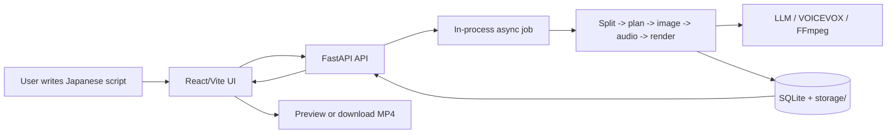
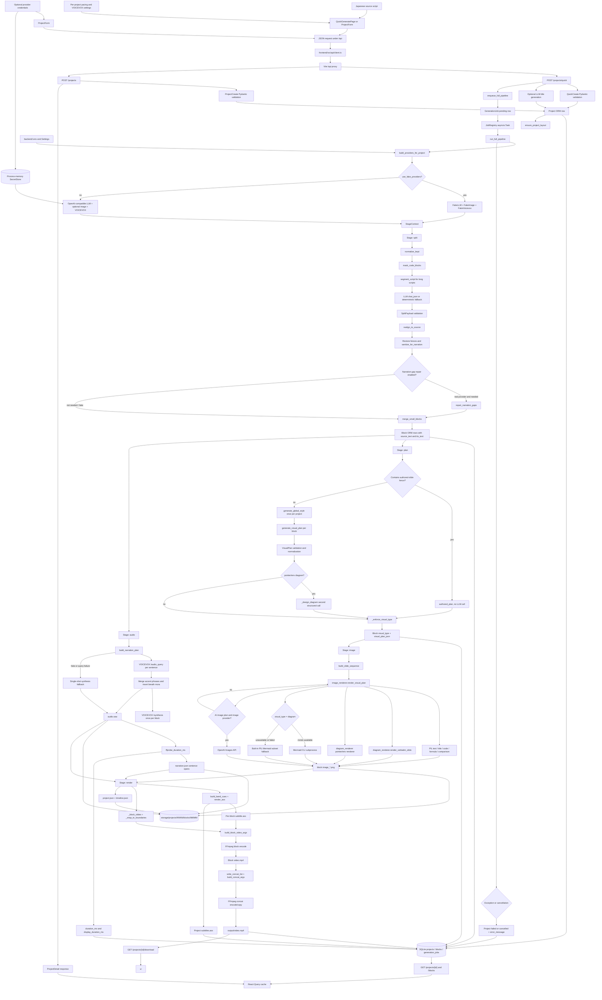
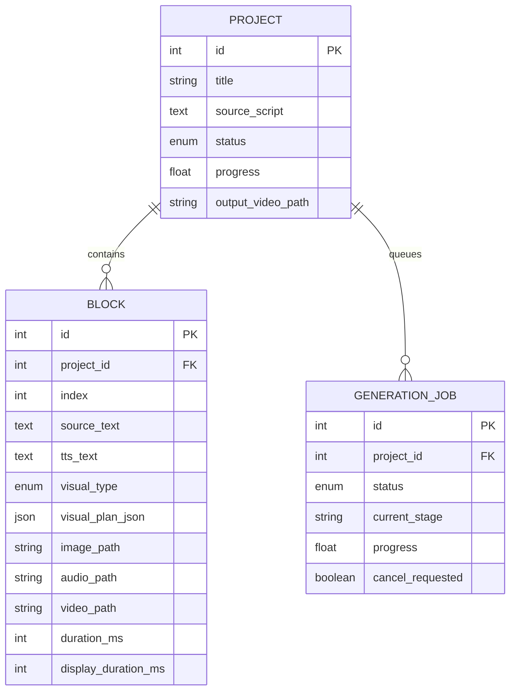
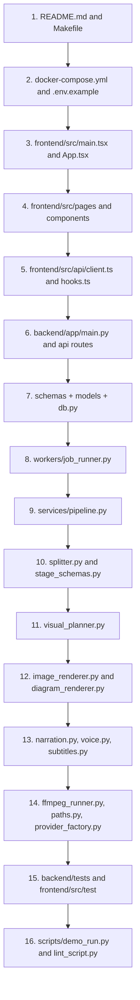

# BlockVideo Development Guideline

## 1. Scope and Abstract

This document is a source-based handover guide for BlockVideo. It describes the
repository as it exists in the checked-out tree, rather than describing a
future architecture. The primary runtime is a local web application:

```text
Japanese script -> blocks -> visual plans -> PNG slides -> VOICEVOX audio
-> subtitles and timing -> FFmpeg MP4
```

BlockVideo has two application processes and one optional external rendering
process:

- The Vite/React frontend runs on `127.0.0.1:5173`.
- The FastAPI backend runs on `127.0.0.1:8000`.
- VOICEVOX Engine normally runs separately on `127.0.0.1:50021`.
- LLM, image, Mermaid CLI, FFmpeg, and FFprobe are optional provider/tool
  boundaries selected by configuration or project mode.

The project is deliberately local and has no authentication, billing, or
remote job queue. API keys supplied by the UI are kept in the backend process's
`SecretStore` and are not persisted in SQLite.

## 2. Abstract Diagram

This is the shortest useful view of the system. The backend owns the durable
project state and the media pipeline; the browser only submits requests and
polls results.



## 3. Full Data Flow

The following diagram follows both the data and the important side effects.
Solid arrows are normal data movement. The branch labels show whether a
project uses real providers or deterministic fake providers.



### Stage responsibilities

| Stage | Main implementation | Input | Persistent output |
|---|---|---|---|
| Split | `services/splitter.py` | `Project.source_script` | `Block.source_text`, `Block.tts_text` |
| Plan | `services/visual_planner.py` | Block text and global style | `visual_type`, `visual_plan_json`, `content_hash` |
| Image | `services/image_renderer.py`, `diagram_renderer.py` | Visual plan and authored fences | `image.png`, optional `image_N.png` |
| Audio | `services/narration.py`, `voice.py` | `tts_text` and VOICEVOX settings | `audio.wav`, `narration.json`, durations |
| Render | `subtitles.py`, `ffmpeg_runner.py`, `pipeline.py` | Images, audio, spans | `subtitle.ass`, block MP4, final MP4, metadata |

The database stores paths relative to `Settings.storage_root`. API artifact
routes resolve those paths with `validate_artifact_path` before returning a
file, so a path saved in SQLite must remain storage-relative.

## 4. Full Calling Chain

This is the source-level call graph for the normal quick-generation path. It
shows the main functions rather than every local loop or PIL drawing primitive.
The arrows are call/reference relationships, not HTTP response timing.

```mermaid
flowchart TD
    subgraph Browser[Frontend runtime]
        boot[main.tsx: createRoot]
        app[App: BrowserRouter + Routes]
        quickPage[QuickGeneratePage]
        formPage[ProjectForm]
        hooks[api/hooks.ts React Query hooks]
        apiClient[api/client.ts request and api methods]
        boot --> app
        app --> quickPage
        app --> formPage
        quickPage --> hooks
        formPage --> hooks
        hooks --> apiClient
    end

    subgraph HTTP[FastAPI boundary]
        createApp[main.create_app]
        lifespan[main.lifespan]
        health[routes_health.health / voicevox_speakers]
        quickCreate[routes_projects.quick_create]
        createProject[routes_projects.create_project]
        projectRead[routes_projects.get_project / list_projects]
        blockRead[routes_projects.list_blocks / routes_blocks.get_block]
        artifacts[routes_projects.artifact_* / download_video]
        createApp --> lifespan
        createApp --> health
        createApp --> quickCreate
        createApp --> createProject
        createApp --> projectRead
        createApp --> blockRead
        createApp --> artifacts
    end

    subgraph Queue[Job layer]
        enqueueFull[job_runner.enqueue_full_pipeline]
        enqueueRender[job_runner.enqueue_rerender]
        enqueueVisual[job_runner.enqueue_block_visual_rerun]
        enqueueAudio[job_runner.enqueue_block_audio_rerun]
        submit[JobRegistry.submit]
        task[asyncio.Task _runner]
        enqueueFull --> submit
        enqueueRender --> submit
        enqueueVisual --> submit
        enqueueAudio --> submit
        submit --> task
    end

    subgraph Pipeline[Pipeline orchestration]
        fullPipeline[pipeline.run_full_pipeline]
        context[StageContext.report and cancellation]
        split[run_split_stage]
        plan[run_visual_plan_stage]
        image[run_image_stage]
        audio[run_audio_stage]
        render[run_render_stage]
        rerunVisual[pipeline.rerun_block_visual]
        rerunAudio[pipeline.rerun_block_audio]
        rerender[ pipeline.rerender_project]
        task --> fullPipeline
        fullPipeline --> context
        fullPipeline --> split
        fullPipeline --> plan
        fullPipeline --> image
        fullPipeline --> audio
        fullPipeline --> render
        rerunVisual --> imageBlock[_render_block_image]
        rerunAudio --> audioBlock[_render_block_audio]
        rerender --> render
    end

    subgraph Split[Script splitting]
        normalize[splitter.normalize_kept]
        mask[splitter.mask_code_blocks]
        segment[splitter.segment_script]
        splitScript[splitter.split_script]
        splitSegment[splitter.split_segment]
        splitPrompt[splitter._build_split_prompt]
        llmJson[LLMProvider.chat_json]
        validate[SplitPayload.model_validate]
        align[splitter.realign_to_source]
        sanitize[splitter.sanitize_for_narration]
        repair[splitter.repair_narration_gaps]
        merge[splitter.merge_small_blocks]
        split --> splitScript
        splitScript --> normalize
        splitScript --> mask
        splitScript --> segment
        splitScript --> splitSegment
        splitSegment --> splitPrompt
        splitPrompt --> llmJson
        llmJson --> validate
        validate --> align
        align --> sanitize
        sanitize --> repair
        repair --> merge
    end

    subgraph Planning[Visual planning]
        style_node["visual planner global style"]
        title_node["visual planner title"]
        authored_node["authored slide extraction"]
        visualPlan_node["generate visual plan"]
        normalizePlan_node["normalize plan payload"]
        diagramDesign_node["design diagram"]
        guard_node["enforce visual type"]
        sequence_node["build slide sequence"]
        plan --> style_node
        plan --> authored_node
        plan --> visualPlan_node
        visualPlan_node --> normalizePlan_node
        visualPlan_node --> diagramDesign_node
        visualPlan_node --> guard_node
        image --> sequence_node
    end

    subgraph Providers[Provider and rendering boundaries]
        factory[build providers for project]
        fake[Fake providers]
        real[provider clients]
        pil[render visual plan]
        diagrams[render diagram slide]
        mermaid[render diagram via mermaid]
        ffmpeg[run ffmpeg]
        factory --> fake
        factory --> real
        sequence --> pil
        pil --> diagrams
        pil --> mermaid
        render --> ffmpeg
    end

    subgraph Audio[Audio and subtitle timing]
        narrationPlan[build narration plan]
        voice[synthesize block]
        audioResult[AudioResult]
        spans[write and read spans]
        cues[build band cues]
        ass[render subtitle ASS]
        audio --> voice
        voice --> narrationPlan
        narrationPlan --> audioResult
        audioResult --> spans
        render --> cues
        cues --> ass
    end

    subgraph Persistence[Persistence and files]
        settings[get settings]
        db[database session helpers]
        models[project and block models]
        paths[path helpers]
        files[(storage/projects/NNNN)]
        settings --> db
        db --> models
        paths --> files
        split --> models
        plan --> models
        audio --> models
        render --> models
        artifacts --> paths
        models --> files
    end

    apiClient --> quickCreate
    apiClient --> createProject
    quickCreate --> enqueueFull
    createProject --> db
    quickCreate --> factory
    enqueueFull --> db
    fullPipeline --> factory
    fullPipeline --> db
    splitScript --> models
    visualPlan --> models
    pil --> files
    voice --> files
    ffmpeg --> files
    files --> artifacts
    projectRead --> apiClient
    blockRead --> apiClient
    artifacts --> apiClient
    apiClient --> quickPage
    apiClient --> formPage
```



### Normal entry-point narrative

1. `frontend/src/main.tsx` creates one `QueryClient`, mounts `App`, and imports
   the Tailwind stylesheet.
2. `frontend/src/App.tsx` maps `/` to `QuickGeneratePage`, `/projects` to
   `ProjectsPage`, `/projects/new` to `NewProjectPage`, and
   `/projects/:id` to `ProjectDetailPage`.
3. `QuickGeneratePage.start` sends script text plus pacing fields through
   `useQuickCreate`, which calls `api.quickCreate`.
4. Vite proxies `/api` to the backend. `quick_create` validates the payload,
   creates a `Project`, optionally obtains an LLM title, creates a
   `GenerationJob`, and submits the job to `JobRegistry`.
5. `JobRegistry._runner` opens its own SQLAlchemy session, marks the job
   running, executes `run_full_pipeline`, and commits a final job status.
6. `run_full_pipeline` creates a `ProviderBundle` and `StageContext`, updates
   project stage/progress, then runs split, plan, image, audio, and render in
   that order.
7. The page uses `useLiveProject` to poll the project every 1.5 seconds until
   the API reports `completed` or `failed`. The project detail page separately
   polls both project and block lists while a job is running.
8. After completion, the browser does not read local filesystem paths directly.
   It requests `/api/projects/{id}/download` or an artifact endpoint, and the
   backend resolves and serves the stored file.

### Important rerun chains

| User action | API route | Worker function | Reused work |
|---|---|---|---|
| Generate or regenerate all | `POST /projects/{id}/generate-all` | `run_full_pipeline` | Existing stage status and files may be reused |
| Rendering only | `POST /projects/{id}/rerender` | `rerender_project` | Split, plan, image, and audio |
| Visual regeneration | `POST /blocks/{id}/regenerate-visual` | `rerun_block_visual` | Split, audio, and other blocks |
| Audio regeneration | `POST /blocks/{id}/regenerate-audio` | `rerun_block_audio` | Split, visual plan, and images |
| Block rerender button | `POST /blocks/{id}/rerender` | `rerender_project` | Whole project render stage |

## 5. Folder Analysis

### Repository-level folders

| Folder | Purpose | Relationship |
|---|---|---|
| `backend/` | Python/FastAPI service, SQLite ORM, providers, pipeline, and backend tests | The frontend calls its `/api` routes; it owns all media generation and persistence |
| `backend/app/` | Installable Python application package | `backend/app/main.py` is the ASGI entry point; all backend imports start here |
| `backend/tests/` | Pytest unit, integration, API, and rendering tests | Imports `app` directly and validates services without requiring the browser |
| `frontend/` | React/Vite/TypeScript application | Uses `/api` relative URLs and Vite's development proxy to reach `backend` |
| `frontend/src/` | Frontend source tree | `main.tsx` bootstraps `App`; pages compose components and API hooks |
| `frontend/src/api/` | Typed fetch wrapper and React Query hooks | The only normal frontend-to-backend boundary |
| `frontend/src/components/` | Reusable layout, form, progress, status, and block UI | Used by pages; components call hooks rather than issuing raw fetches |
| `frontend/src/lib/` | Shared frontend types and Zod validation | Types mirror backend schemas and should be updated with API changes |
| `frontend/src/pages/` | Route-level screens | `App.tsx` chooses a page; pages compose components and hooks |
| `frontend/src/test/` | Vitest and Testing Library tests | Exercises frontend validation and small UI behaviors |
| `scripts/` | CLI helpers for demo generation and script linting | `demo_run.py` uses the public API; `lint_script.py` imports backend parsing helpers |
| `samples/` | Example Japanese input script | Used by `make demo` and `scripts/demo_run.py` |
| `docs/` | Prompt and visual reference assets | `script-prompt.md` defines the authored script format; PNGs document output style |
| `tools/mermaid/` | Isolated Mermaid CLI helper package/configuration | Optional support for the backend Mermaid subprocess; not imported by Python |
| `storage/` | Runtime-generated SQLite, project artifacts, logs, and metadata | Created at runtime and ignored by Git; never treat it as source |

### Backend package folders

| Folder | Main responsibility | References |
|---|---|---|
| `app/api/` | HTTP routes, response mapping, and safe artifact path validation | Calls `app.db`, `app.schemas`, workers, and selected services |
| `app/core/` | Settings, logging, and secret redaction/storage | Imported by almost every backend layer; it must not depend on route code |
| `app/models/` | SQLAlchemy tables and enum values | Registered by `db.init_db`; referenced by routes, pipeline, and schemas |
| `app/providers/` | External-service interfaces and concrete/fake clients | Constructed only through `services/provider_factory.py` and consumed by services |
| `app/schemas/` | Pydantic HTTP request/response contracts | Defines the API contract; stage-specific LLM contracts live in `services/stage_schemas.py` |
| `app/services/` | Pure-ish transformation, rendering, audio, subtitle, path, and orchestration code | The pipeline composes these services; services should not import frontend code |
| `app/workers/` | In-process async job lifecycle and cancellation | Routes enqueue work here; this layer invokes pipeline entry points |

### Backend file map

| File | Role |
|---|---|
| `app/main.py` | Creates FastAPI, installs CORS, registers routers, initializes logging/database |
| `app/db.py` | Creates the synchronous SQLite engine/session and performs additive startup schema updates |
| `app/core/config.py` | Loads cached `Settings` and resolves executable paths |
| `app/core/security.py` | Masks API keys and stores per-project secrets in process memory |
| `app/core/logging.py` | Configures Loguru and redacts log messages |
| `app/models/project.py` | Project row and project lifecycle status |
| `app/models/block.py` | One pipeline block and its artifact/stage state |
| `app/models/job.py` | Long-running job state |
| `app/schemas/__init__.py` | HTTP payload and response models |
| `app/api/routes_projects.py` | Project CRUD, queue controls, status, and artifact endpoints |
| `app/api/routes_blocks.py` | Block inspection and partial rerun endpoints |
| `app/api/routes_health.py` | FFmpeg health and VOICEVOX speaker discovery |
| `app/api/utils.py` | Prevents artifact path escape from the storage root |
| `app/workers/job_runner.py` | Converts API requests into `asyncio.Task` jobs |
| `app/services/pipeline.py` | Stage order, database updates, reruns, timeline, and final media orchestration |
| `app/services/splitter.py` | Masks code, requests/validates LLM splits, repairs narration, and merges blocks |
| `app/services/visual_planner.py` | Authored-slide extraction, LLM visual selection, diagram design, and guardrails |
| `app/services/stage_schemas.py` | Pydantic validation for LLM split and visual-plan JSON |
| `app/services/image_renderer.py` | Dispatches visual plans to PIL, Mermaid, or structured diagram renderers |
| `app/services/diagram_renderer.py` | Draws authored grids, pointer diagrams, and environment diagrams with PIL |
| `app/services/narration.py` | Computes sentence offsets and measured VOICEVOX timing spans |
| `app/services/voice.py` | Synthesizes audio, retries, probes duration, and computes display duration |
| `app/services/subtitles.py` | Wraps Japanese narration and writes ASS/VTT subtitles |
| `app/services/ffmpeg_runner.py` | Builds safe argv arrays and runs FFmpeg/FFprobe |
| `app/services/provider_factory.py` | Selects fake/real clients and project-level settings |
| `app/services/paths.py` | Defines the runtime storage layout |
| `app/services/hashing.py` | Stable input hashes used by the pipeline's cache metadata |
| `app/services/mermaid_renderer.py` | Optional `mmdc` subprocess integration |

## 6. Domain and Persistence Model

### Core domain terms

- **Project**: one requested video, its source script, provider configuration,
  pacing settings, final paths, and overall lifecycle status.
- **Block**: one script chunk. A block contains spoken narration plus one or
  more visual slides and produces one block-level MP4.
- **Visual plan**: validated JSON deciding whether the block is text, code,
  formula, comparison, Mermaid, authored, pointer, environment, or image based.
- **Display duration**: audio duration plus pre/post reading margins, subject to
  the project minimum. It controls how long the slide remains visible.
- **Narration span**: a sentence's character offsets and measured start/end
  milliseconds, persisted in `narration.json`.
- **Authored slide**: a ` ```slide ` fence whose body is drawn verbatim; it
  bypasses visual LLM planning.
- **Structured diagram**: pointer/environment JSON rendered locally by PIL,
  rather than Mermaid.

### ORM relationship



### Runtime artifact layout

The implementation's canonical layout is:

```text
storage/
├── blockvideo.db
└── projects/0001/
    ├── blocks/0000/
    │   ├── image.png
    │   ├── image_1.png ... image_8.png
    │   ├── audio.wav
    │   ├── narration.json
    │   ├── subtitle.ass
    │   └── video.mp4
    ├── output/video.mp4
    ├── subtitles.ass
    ├── project.json
    ├── timeline.json
    ├── concat.list
    └── logs/
```

`services/paths.py` is the source of truth for these names. Do not construct
artifact paths ad hoc in a route or component. Persist only the relative path
returned by `relpath_for_db`; resolve it through `abspath_from_db` or
`validate_artifact_path` when accessing disk.

## 7. API and Frontend Contract

| Method | Endpoint | Backend handler | Frontend caller |
|---|---|---|---|
| `GET` | `/api/health` | `routes_health.health` | `api.health` |
| `GET` | `/api/voicevox/speakers` | `routes_health.voicevox_speakers` | `api.speakers`, `useSpeakers` |
| `POST` | `/api/projects/quick` | `routes_projects.quick_create` | `useQuickCreate` |
| `POST` | `/api/projects` | `routes_projects.create_project` | `useCreateProject` |
| `GET` | `/api/projects` | `list_projects` | `useProjects` |
| `GET` | `/api/projects/{id}` | `get_project` | `useProject`, `useLiveProject` |
| `DELETE` | `/api/projects/{id}` | `delete_project` | `useDeleteProject` |
| `PATCH` | `/api/projects/{id}` | `patch_project` | No current UI caller |
| `GET` | `/api/projects/{id}/blocks` | `list_blocks` | `useProjectBlocks` |
| `GET` | `/api/projects/{id}/jobs` | `list_jobs` | No current UI caller |
| `POST` | `/api/projects/{id}/generate-all` | `generate_all` | `useGenerateAll` |
| `POST` | `/api/projects/{id}/cancel` | `cancel_project` | `useCancel` |
| `POST` | `/api/projects/{id}/rerender` | `rerender` | `useRerender` |
| `GET` | `/api/projects/{id}/download` | `download_video` | Video/download links |
| `GET` | `/api/projects/{id}/artifacts/{kind}/{index}` | `artifact_*` | `api.artifactUrl` |
| `GET` | `/api/blocks/{id}` | `get_block` | No current UI caller |
| `PATCH` | `/api/blocks/{id}` | `patch_block` | No current UI caller |
| `POST` | `/api/blocks/{id}/regenerate-visual` | `regenerate_visual` | `useRegenerateBlockVisual` |
| `POST` | `/api/blocks/{id}/regenerate-audio` | `regenerate_audio` | `useRegenerateBlockAudio` |
| `POST` | `/api/blocks/{id}/rerender` | `rerender_block` | `api.rerenderBlock` exists; UI uses project rerender hook |

The frontend's `frontend/src/lib/types.ts` is a manually maintained mirror of
the backend schemas. Update it whenever `backend/app/schemas/__init__.py`
changes. A response's filesystem path is metadata; the browser should use the
API download/artifact endpoint instead of treating it as a local browser path.

## 8. Read-Order Map

Use this order when taking over the project. It minimizes context switching and
follows data from the user boundary to the file boundary.



### Why this order works

1. The README establishes input format, external dependencies, and output
   expectations.
2. The frontend reveals which API actions a user can actually trigger.
3. Routes and schemas define the network contract before implementation detail.
4. Models and `db.py` explain what survives a process restart.
5. `job_runner.py` explains why API requests return before media exists.
6. `pipeline.py` gives the stage order; each service can then be read as one
   stage rather than as an isolated utility collection.
7. Provider and subprocess modules explain which operations are local, remote,
   fake, or optional.
8. Tests are most useful after the production call path is understood because
   their filenames then identify the invariant being protected.

## 9. Maintenance Map

### Change-impact guide

| Change request | Start reading here | Usually also update | Verification |
|---|---|---|---|
| Add or change an API field | `schemas/__init__.py` | ORM model, route mapper, `frontend/src/lib/types.ts`, form/hooks | Backend API tests, frontend typecheck |
| Change quick-generate UX | `QuickGeneratePage.tsx` | `PacingSettings.tsx`, `hooks.ts`, `client.ts`, `QuickCreate` | Frontend tests and manual browser flow |
| Change detailed project form | `ProjectForm.tsx` | `validation.ts`, `ProjectCreate`, route mapper | Frontend tests and API tests |
| Change block splitting | `splitter.py` | `stage_schemas.py`, pipeline split stage, splitter tests | `test_splitter*`, narration tests, integration test |
| Change authored ` ```slide ` behavior | `visual_planner.py` | `diagram_renderer.py`, `image_renderer.py`, script linter | Authored-slide and diagram tests |
| Add a visual type | `models/block.py` and `stage_schemas.py` | planner prompt/schema, renderer dispatch, frontend `VisualType`, tests | Visual planner, renderer, typecheck |
| Change Japanese timing | `narration.py` and `voice.py` | `subtitles.py`, `pipeline.py`, timing tests | Narration/subtitle/FFmpeg tests |
| Change subtitle appearance/layout | `subtitles.py` | `pipeline._write_block_ass`, project schema/form | Subtitle-band and cue tests; inspect an MP4 |
| Change video encoding | `ffmpeg_runner.py` | pipeline render stage, duration tests | FFmpeg argv tests and demo if FFmpeg exists |
| Change storage paths | `paths.py` | artifact routes, model path fields, README | Security/API/integration tests and migration check |
| Add an external provider | Provider interface first | concrete provider, `provider_factory.py`, fake provider, tests | Fake integration plus provider unit tests |
| Change database columns | ORM model and `db.init_db` | server defaults, response schemas | Existing-database migration test; never assume `create_all` alters columns |
| Change job behavior | `workers/job_runner.py` | routes, pipeline cancellation/progress | API/integration tests and restart/cancel manual test |

### Safe implementation rules

- Keep HTTP handlers thin. Validate at the Pydantic boundary, persist through
  SQLAlchemy, and enqueue work instead of running long media operations in the
  request thread.
- Add new provider calls behind an interface and keep `Fake*` behavior
  deterministic so integration tests remain offline.
- Treat LLM output as untrusted input. Validate with Pydantic before saving a
  plan or passing content to a renderer or subprocess.
- Pass FFmpeg and Mermaid arguments as lists. Do not introduce shell command
  strings, even for paths or model-controlled content.
- Preserve authored slide whitespace. `normalize_kept` intentionally collapses
  prose spacing but leaves fenced content unchanged.
- Keep sentence timing and audio together. If the audio algorithm changes,
  update `narration.json` generation and all consumers of `read_spans`.
- Use `services/paths.py` for every artifact path and keep database paths
  relative to the storage root.
- When adding a non-null database column, provide a `server_default`; the
  startup additive migration cannot populate old rows otherwise.
- Remember that the worker is process-local. A backend restart loses running
  task objects, although existing files remain available for later reruns.
- Update backend schemas and frontend TypeScript mirrors in the same change.

### Suggested development loop

```text
1. Read the affected row in the change-impact table.
2. Add or update a focused backend/frontend test.
3. Run the fake-provider integration path.
4. Run type and lint checks.
5. Run the full test suite.
6. Start backend and frontend manually for a browser/API smoke check.
7. Inspect generated image, subtitle, narration, and MP4 artifacts.
```

Recommended commands from the repository root:

```bash
make install
make test
make lint
make ffmpeg-check
make demo
```

For a script-only preflight:

```bash
cd backend
uv run python ../scripts/lint_script.py ../samples/compose_multiplatform_intro.txt
```

## 10. Function-Level Guide

### Application and persistence

- `app.main.create_app`: constructs FastAPI, configures CORS, registers all
  routers, and installs the catch-all JSON error handler.
- `app.main.lifespan`: configures logging and initializes the SQLite schema on
  application startup.
- `app.db.get_engine` and `get_session_factory`: lazily create shared
  SQLAlchemy infrastructure. `get_db` creates and closes request sessions.
- `app.db.init_db`: imports models so SQLAlchemy sees their metadata, creates
  missing tables, and performs only additive column discovery.
- `app.core.config.get_settings`: returns the cached settings object and
  creates the storage directories. `resolve_ffmpeg`, `resolve_ffprobe`, and
  `resolve_mmdc` select executable paths.

### API and jobs

- `routes_projects.quick_create`: the one-request quick path. It creates a
  project, applies only supplied pacing overrides, optionally generates a
  title, and enqueues the full pipeline.
- `routes_projects.create_project`: creates a project without starting it and
  places request-supplied provider credentials in `SecretStore`.
- `routes_projects._project_summary`, `_project_detail`, `_block_summary`, and
  `_job_summary`: map ORM state into response schemas. Keep these mappings
  synchronized with frontend types.
- `routes_blocks.regenerate_visual` and `regenerate_audio`: validate the block
  and parent project before enqueueing the corresponding partial rerun.
- `JobRegistry.submit`: wraps a coroutine in a process-local task, owns the job
  session, translates exceptions into job status, and exposes cancellation
  through an `asyncio.Event` plus the database flag.
- `enqueue_full_pipeline`, `enqueue_rerender`,
  `enqueue_block_visual_rerun`, and `enqueue_block_audio_rerun`: create a
  `GenerationJob` row and connect it to a pipeline coroutine.

### Pipeline

- `run_full_pipeline`: creates provider/context objects, advances project
  status, runs the five stages in order, and records failure/cancellation.
- `run_split_stage`: writes or updates block rows from `split_script` and
  removes stale blocks from an earlier split.
- `run_visual_plan_stage`: handles authored slides locally, runs independent
  LLM plans concurrently, validates guardrails, and stores the plan JSON.
- `run_image_stage` and `_render_block_image`: create the primary and optional
  additional slide PNGs and remove stale extra images.
- `run_audio_stage` and `_render_block_audio`: synthesize one block, persist
  measured duration and sentence spans, and compute the display hold.
- `run_render_stage`: creates per-block ASS files and MP4s, builds the final
  concat list, writes the final MP4, and emits project/timeline metadata.
- `rerender_project`: deletes stale block/final videos and reuses existing
  images/audio to run only the render path.

### Transformation and rendering services

- `splitter.split_script`: masks fenced content, segments long scripts,
  concurrently asks the LLM to split each segment, realigns returned
  boundaries to the original text, sanitizes speech, repairs gaps, and merges
  undersized blocks.
- `visual_planner.extract_authored_slide`: recognizes the local
  ` ```slide heading` format and returns exact body text.
- `visual_planner.generate_visual_plan`: requests a visual type, optionally
  performs a second structured diagram call, and applies server-side type
  guards.
- `visual_planner.build_slide_sequence`: combines the primary plan with
  additional source fences without spending another LLM call.
- `image_renderer.render_visual_plan`: dispatches a validated plan to a
  specialized renderer and provides readable text fallbacks when a structured
  renderer fails.
- `diagram_renderer.render_verbatim_slide`, `render_pointer_diagram`, and
  `render_env_diagram`: render local visual structures on a fixed-size canvas;
  the authored path preserves a character grid for Japanese/ASCII alignment.
- `narration.build_narration_plan`: queries VOICEVOX per sentence, merges
  accent phrases, inserts configurable breath moras, and maps sentence text to
  predicted milliseconds.
- `subtitles.build_band_cues`: chunks narration, fits it inside the subtitle
  band, and uses measured character-time mapping when available.
- `ffmpeg_runner.build_block_video_args` and `build_concat_args`: create
  shell-free FFmpeg argv lists. `run_ffmpeg` executes them and records logs.

## 11. Static Findings to Keep in Mind

These are observations from the current source, not changes made by this
documentation task. Confirm them before relying on the affected behavior.

- The frontend `VisualType` union does not currently list backend-supported
  `verbatim_slide`, `pointer_diagram`, or `env_diagram` values.
- The frontend `ProjectDetail` type does not include
  `narration_sentence_pause_seconds` or `max_slides_per_block`, although the
  backend response includes them.
- `BlockPatch` calls its field `visual_plan`, while the ORM field is
  `visual_plan_json`; the generic `setattr` loop in `routes_blocks.py` should be
  reviewed before using that patch endpoint.
- `useLiveProject` stops polling for `completed` and `failed` but not
  `cancelled`; a cancelled quick-generation page can continue polling.
- `useRerender` invalidates the project query but not the block query, so a
  detail page may show stale block render status after a rerender.
- The backend has PATCH endpoints that the current frontend does not expose.
  `api.rerenderBlock` exists, but `BlockItem` uses project-level rerender.
- `Settings` contains `crossfade_seconds`, but the positive-crossfade branch
  of `build_concat_args` currently returns the same concat-copy command as the
  zero-crossfade branch.
- `ProjectPatch` does not apply the same URL/position validators as project
  creation. Treat PATCH input as a separate contract when extending it.
- `vite.config.js` and `vite.config.d.ts` appear to be generated companions of
  `vite.config.ts`; edit the TypeScript config, not the generated file.
- The README's sample output tree places `subtitles.ass` under `output/`, while
  `project_subtitle_path` writes it at the project root.
- There is no authentication or authorization. The intended trust boundary is
  a local machine, not a public deployment.
- Jobs are single-process and in memory. Restarting the backend loses task
  execution state, even though generated files and database rows remain.
- `content_hash` is written with visual-plan inputs, but stage invalidation is
  primarily controlled by status flags and file existence. Do not assume every
  input edit automatically invalidates all downstream artifacts.

## 12. Documentation and Commenting Policy

Handwritten runtime modules should have a module docstring or module-level
JSDoc comment. Public classes, exported functions, route handlers, provider
methods, stage functions, and non-obvious helpers should document:

- what data they accept and return;
- which database, filesystem, network, or subprocess side effects they have;
- important fallback, retry, cancellation, or validation behavior;
- whether callers must close a client or preserve a file format.

Keep comments about invariants and boundaries, not line-by-line narration. The
source docstrings added alongside this guide follow that rule so future changes
can be made from the call graph without reverse-engineering every function.
